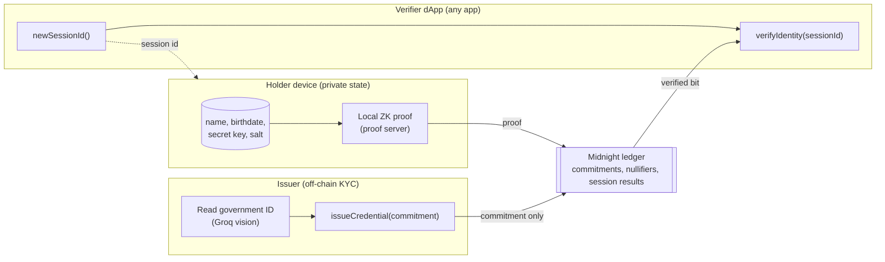
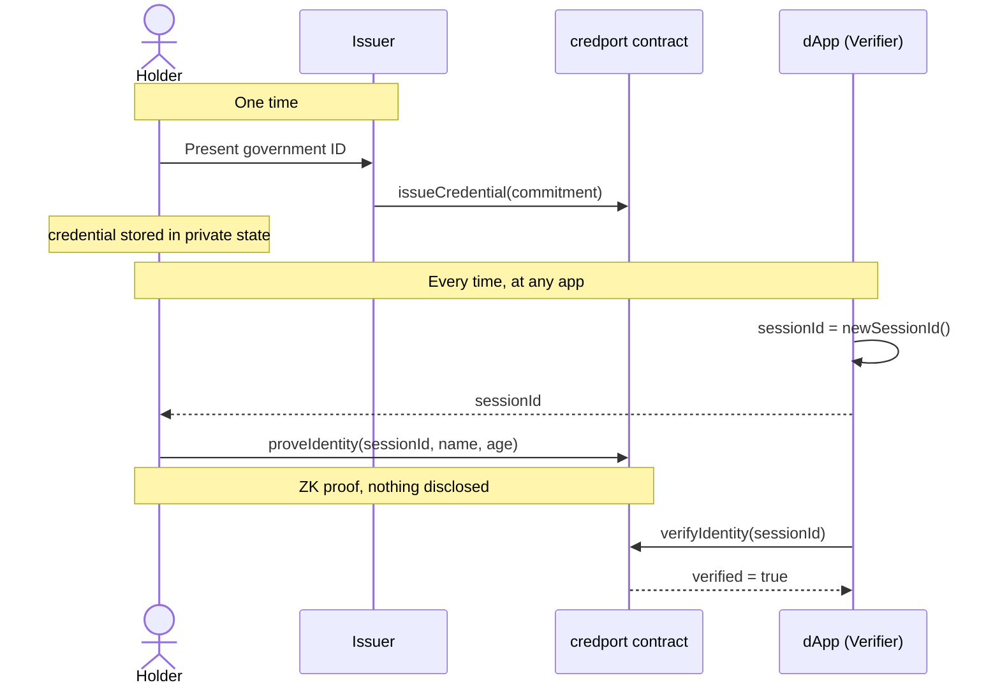

<div align="center">

# credport

### Verify once. Prove anywhere.

A reusable zero-knowledge identity credential on [Midnight](https://midnight.network).
A user verifies a real-world attribute one time, holds the credential privately on their own
device, and proves facts about it to any app. The app learns a single bit, `verified`, and never
sees the name, the birthdate, or the document.

[](https://www.npmjs.com/package/credport)
[](https://www.npmjs.com/package/credport-react)
[](LICENSE)
[](https://midnight.network)

[Live demo](https://credport.vercel.app) &nbsp;/&nbsp; [npm](https://www.npmjs.com/package/credport) &nbsp;/&nbsp; [Integrate](#integrate-in-your-app) &nbsp;/&nbsp; [Test on our site](#test-it-on-the-live-site)

</div>

---

> **Live on Midnight preprod.** Contract
> [`1904b5a37fdcc8eeb62a479e9924de30b51d0e227bc43b045b21806254f994ba`](https://preprod.midnightexplorer.com/contracts/0x1904b5a37fdcc8eeb62a479e9924de30b51d0e227bc43b045b21806254f994ba)
> is the single canonical deployment. The demo verifies against this one contract, and every app that
> consumes credport points at the same address.

## The idea in one line

Identity checks today are done again at every door, and every door keeps a copy of your data.
credport turns the check into a portable proof: you pass a real verification once, and after that
any app can confirm a fact about you (name matches, age is at least N, one unique human) without
ever receiving the underlying data.

The verifying app needs **no wallet, no proof server, and no user data**. It needs only an indexer
connection, a contract address, and a 32-byte session id. That is what makes credport a composable
primitive rather than another siloed KYC flow: one deployment is a network-wide resource that any
number of apps can consume.

## What the chain sees, and what it never sees

| Written to the public ledger | Never leaves the holder's device |
| --- | --- |
| Credential commitment (an opaque hash) | Name, birthdate, country, document |
| Enrollment nullifier (opaque, issuer-time dedup) | The holder's secret key |
| `sessionId` to `verified` (with threshold and as-of date) | The credential salt (commitment opening) |
| Issuer public keys, revocation nullifiers | The Merkle path used inside the proof |

Membership is proven against a Merkle root, so a proof does not reveal which credential produced
it, and it cannot be linked back to issuance.

## How it fits together



The credential is issued once and lives in the holder's private state. To use it, a verifier mints
a session id, the holder produces a local proof against it, and the verifier reads back one bit.



## Install

```bash
npm install credport
# React drop-in gate:
npm install credport-react credport
```

`credport` pulls in `credport-contract`, the compiled Compact bindings, automatically.

## Integrate in your app

### 1. Verify a user (the consumer side, no wallet needed)

This is all a normal app has to run. It mints a session id, hands it to the user's proving flow,
then reads the result. It never touches a wallet, a proof server, or any personal data.

```ts
import { Verifier } from 'credport';
import { setNetworkId } from '@midnight-ntwrk/midnight-js-network-id';

setNetworkId('preprod');

const CONTRACT = '1904b5a37fdcc8eeb62a479e9924de30b51d0e227bc43b045b21806254f994ba';
const verifier = Verifier.connect(CONTRACT); // indexer connection only

// 1. Issue a session id and hand it to the user's proving flow.
const sessionId = verifier.newSessionId();

// 2. The user proves on their own device (next section).

// 3. Read the result. You learn only whether it holds.
const { verified, threshold } = await verifier.verifyIdentity(sessionId, 18);
if (verified) grantAccess();
```

`verifyAgeOver(sessionId, minThreshold)` and `verifyUniqueHuman(sessionId)` follow the same shape.

### 2. Prove on the holder's device

The proving side needs a connected Midnight wallet (Lace or 1AM) and its providers. The holder
enrolls once, receives a credential from an issuer, and from then on proves against any session id.

```ts
import { PassportAPI, Issuer, Holder } from 'credport';

const api = await PassportAPI.join(providers, CONTRACT);

// Enroll once. The secret key never leaves the device.
const holder = new Holder(api);
const enrollment = await holder.enroll();

// The issuer attests after an off-chain check, writing only a commitment.
const issuer = new Issuer(api);
const credential = await issuer.issueCredential(
  { name: 'Erika Mustermann', birthDate: '2000-05-14', country: 276 },
  enrollment,
);
await holder.store(credential);

// Later, prove name and age together against a verifier's session id.
await holder.proveIdentity('Erika Mustermann', 18, { sessionId });
```

### 3. React, in five lines

```tsx
import { ProveAgeGate } from 'credport-react';

<ProveAgeGate
  contractAddress={CONTRACT}   // one deployment serves every app
  connect={connectWallet}      // returns Midnight.js providers for the wallet
  threshold={18}
>
  <MembersOnly />              {/* shown only on a verified result */}
</ProveAgeGate>;
```

Prefer a headless hook? `useCredport({ contractAddress, connect, threshold })` returns
`{ status, error, result, proveAgeOver, reset }`, where `status` moves through `idle`, `connecting`,
`ready`, `proving`, and then `verified` or `rejected`.

## What you can prove

| Circuit | Proves | Discloses |
| --- | --- | --- |
| `proveIdentity` | Name matches a claimed name **and** age is at least a threshold | Only the verified result |
| `proveAgeOver` | Age is at least a threshold, at any value you choose | Only the verified result |
| `proveUniqueHuman` | One credentialed human, with a per-app scoped nullifier | An unlinkable per-app pseudonym |
| `revoke`, `addIssuer` | Issuer and admin management | Standard on-chain records |

`proveResidency` and `proveAccredited` are architected and stubbed. Their attributes are already
bound inside the credential commitment, so turning them on later is purely additive.

## Test it on the live site

A full working demo runs on Midnight preprod at **[credport.vercel.app](https://credport.vercel.app)**.
It is both the marketing page and the real dApp: the "try it" section is the live flow, not a mockup.

1. Open [credport.vercel.app](https://credport.vercel.app).
2. Connect a Midnight wallet on **preprod** (Lace or 1AM). The 1AM wallet credits test DUST
   immediately, which is the smoother path.
3. The page joins the single preprod deployment automatically. There is no deploy step; every session
   verifies against the same contract.
4. Upload a government ID and type your name. The document runs through Groq vision server-side to
   read name, date of birth, and country, and to check the name against the document. The image is
   processed for that one request and never stored.
5. Issue the credential. Only a commitment is written on-chain.
6. Prove your name and age. The dApp reads back a single `verified` result, and you can confirm on the
   preprod explorer that the transaction against contract
   [`1904b5a37fdcc8eeb62a479e9924de30b51d0e227bc43b045b21806254f994ba`](https://preprod.midnightexplorer.com/contracts/0x1904b5a37fdcc8eeb62a479e9924de30b51d0e227bc43b045b21806254f994ba)
   carries a commitment and a verified record with no birthdate anywhere.

## Why it has to be on Midnight

Privacy here is load-bearing, not decorative.

- **Kachina private state** keeps attributes and the credential opening on the holder's device as
  first-class protocol citizens (witnesses), not as an app-level bolt-on.
- **The `disclose()` discipline** in Compact means every value that reaches the ledger is
  acknowledged explicitly. The compiler rejects accidental leaks of witness data.
- **Local proof generation** means even the proof material never leaves the holder's machine.

On a transparent chain this is impossible: either the attribute goes on-chain and is public forever,
or verification is centralized off-chain and you are back to trusting the verifier. Midnight gives
integrity and secrecy at the same time.

## Monorepo layout

```
contract/        Compact contract, witnesses, and compiled artifacts (compactc 0.31.1, language 0.23)
passport-sdk/    credport, the reusable core primitive (Issuer / Holder / Verifier)
packages/react/  credport-react, the drop-in ProveAgeGate and useCredport hook
kyc-api/         Serverless Groq document-KYC function (deployed to Vercel)
server/          Local KYC plus read-only verification gateway for non-JS clients
verifier-ui/     The product: one React and Vite surface that is both the site and the live dApp
issuer-cli/      Headless deploy plus on-chain smoke cycle from a seed phrase
scripts/         Cross-platform build helpers
```

## Run it locally

Prerequisites: Node 24 or newer, Docker (WSL2 on Windows), a Midnight wallet, and the Compact
toolchain (`compactc 0.31.x`).

```bash
# 1. Proof server. Pin 8.0.3 to match the preprod matrix. Do not use :latest,
#    which produces proofs preprod rejects with Custom(182).
docker run -d -p 6300:6300 --name midnight-proof-server \
  midnightntwrk/proof-server:8.0.3 midnight-proof-server -v

# 2. Install, compile the contract, build every workspace.
npm install
npm run compact
npm run build

# 3. Run the demo dApp.
npm run dev            # http://localhost:5173
```

Have a funded preprod seed phrase? Run a full headless `issue` to `prove` to `verify` cycle without
a browser:

```bash
MNEMONIC="word1 word2 ... word24" npm run deploy
```

It builds the wallet from the mnemonic with the same BIP39 derivation Lace uses, deploys the
contract, proves on-chain, and writes `deployment.json`.

## Security notes (honest scope)

This project hardened the four issues an adversarial multi-agent review flagged as critical or high:
a double-witness-read age forge (fixed by threading every witness through a single read), a missing
`setNetworkId` that blocked every transaction, a publicly precomputable revocation nullifier (now
derived from the credential's private salt), and a globally trackable unique-human nullifier (now
key-bound and scoped per app). Intentionally out of scope for this build:

- **Cross-enrollment sybil resistance is the issuer's job.** The on-chain nullifier set only dedups
  the value the issuer submits. For true one-human-one-credential, the issuer derives the enrollment
  nullifier from a KYC-unique identifier and de-duplicates humans off-chain. No purely on-chain
  scheme can enforce this against user-chosen keys.
- **Session binding.** A verified flag is currently bearer-style and not bound to a specific prover.
  A production version binds a holder-scoped session nullifier.
- `asOfDate` is prover-supplied, so verifiers must reject stale or future-dated proofs. The bundled
  verifier does exactly that.
- One deployment equals one issuer set. Any registered issuer is trusted for attribute correctness.

Built against compactc 0.31.1 (language 0.23), Midnight.js 4.1.1, DApp Connector 4.x, proof server
`midnightntwrk/proof-server:8.0.3`, on preprod.

## License

Apache-2.0. See [LICENSE](LICENSE).
